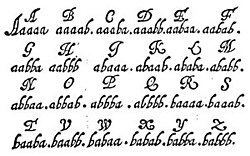

# HyperStream Test #2
## Deskripsi Challange
I love the smell of bacon in the morning! ABAAAABABAABBABBAABBAABAAAAAABAAAAAAAABAABBABABBAAAAABBABBABABBAABAABABABBAABBABBAABB

## Penyelesailan
Deskripsi challange nya yaitu bacon memberikan kita sebuah petunjuk bahwa ini merupakan bacon cipher.
### Apa itu bacon cipher??

Sandi Bacon atau sandi Baconian adalah sebuah metode penyandian pesan steganografi yang dirancang oleh Francis Bacon pada tahun 1605. Dalam steganografi, sebuah pesan disembunyikan dalam penyajian teks, bukan isinya. Sandi Baconian dikategorikan sebagai sandi substitusi (dalam kode biasa) dan sandi penyembunyian (menggunakan dua jenis huruf). untuk jelasnya bisa kalian [baca disini](https://en.wikipedia.org/wiki/Bacon%27s_cipher)

### Pembuatan progaram decrypt
setelah melihat pola ciphernya a merupakan 0 dan b merupakan 1, dan untuk panjang bitnya adalah 5. Kemudian hasil desimal dari biner tersebut merupakan representasi dari urutan alphabet. Berikut programnya :

```python
def bacon_cipher(c):
    result = ''

    for b in c:
        if b == 'A':
            result += '0'
        else:
            result += '1'

    return ' '.join(result[i:i+5] for i in range(0,len(result),5))


flag = 'ABAAAABABAABBABBAABBAABAAAAAABAAAAAAAABAABBABABBAAAAABBABBABABBAABAABABABBAABBABBAABB'
alphabet = 'abcdefghiklmnopqrstuwxyz'

print(''.join(alphabet[int(b, 2)] for b in bacon_cipher(flag).split()))
```