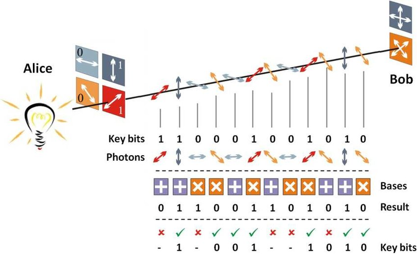
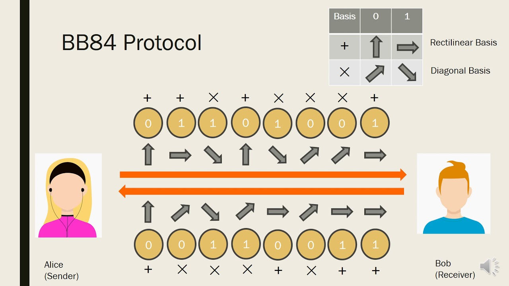

# The Most Secured Crypto-Channel
## Deskripsi Challange
Para ilmuwan telah meluncurkan satelit dengan saluran kripto paling aman di dunia! Saluran tersebut adalah saluran kuantum (BB84). Namun, para peretas telah berhasil mengendusnya. Anda harus membantu para peretas tersebut untuk mencari tahu apa yang ada di dalam transmisi satelit. Berkas: 
[https://mega.nz/#!jfpChKTT!TTDfy2l1hGrNwDrM3DQEjX6kmUVDy5DmMatnka5NvXc](https://mega.nz/#!jfpChKTT!TTDfy2l1hGrNwDrM3DQEjX6kmUVDy5DmMatnka5NvXc)

## Penjelasan

Kata kuncinya ada pada BB84, [BB84](https://en.wikipedia.org/wiki/BB84) adalah skema distribusi kunci kuantum yang dikembangkan oleh Charles Bennett dan Gilles Brassard pada tahun 1984. Ini adalah protokol kriptografi kuantum pertama.

Sistem BB84 QKD mentransmisikan masing-masing foton melalui kabel serat optik, dengan setiap foton mewakili satu bit data (nol atau satu). Ada dua buah istilah yaitu Bases dan Polarize. Basis punya dua jenis yaotu vertikal(+) dan diagonal(x). Dan untuk Polarize punya 4 yaitu Horizontal(| representasi 1), Vartikal(- representasi 0), Diagonal kanan(/ representasi 1), dan Diagonal kiri(\ representasi 0).

Simplenya cara enkripsinya sebagai berikut:
1. Kita tentukan beberapa qbit(quantum bit) acak contohnya `01011011`
2. Lalu pilih basisnya misalnya `++xx+++x`
3. nah maka proton ata polarize yang dihasilkan adalah `-|\/||-/`
4. Lawan bicara kita sebut saja adit juga harus memilih qbit dan basis misalnya `+xx+++xx` dan `11110101`, dan polarize yang dihasilkan adalah `|//|-|\/`

| Nama | Usia | Hobi |
|------|------|------|
| Budi | 20   | Membaca |
| Siti | 19   | Memasak |
| Dodi | 22   | Bermain Musik |