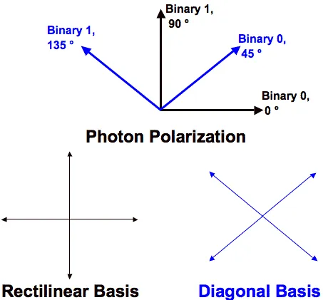

# The Most Secured Crypto-Channel
## Deskripsi Challange
Para ilmuwan telah meluncurkan satelit dengan saluran kripto paling aman di dunia! Saluran tersebut adalah saluran kuantum (BB84). Namun, para peretas telah berhasil mengendusnya. Anda harus membantu para peretas tersebut untuk mencari tahu apa yang ada di dalam transmisi satelit. Berkas: 
[https://mega.nz/#!jfpChKTT!TTDfy2l1hGrNwDrM3DQEjX6kmUVDy5DmMatnka5NvXc](https://mega.nz/#!jfpChKTT!TTDfy2l1hGrNwDrM3DQEjX6kmUVDy5DmMatnka5NvXc)

## Penjelasan

Kata kuncinya ada pada BB84, [BB84](https://en.wikipedia.org/wiki/BB84) adalah skema distribusi kunci kuantum yang dikembangkan oleh Charles Bennett dan Gilles Brassard pada tahun 1984. Ini adalah protokol kriptografi kuantum pertama.

Sistem BB84 QKD mentransmisikan masing-masing foton melalui kabel serat optik, dengan setiap foton mewakili satu bit data (nol atau satu). Ada dua buah istilah yaitu Bases dan Polarize. Basis punya dua jenis yaotu vertikal(+) dan diagonal(x). Dan untuk Polarize punya 4 yaitu Horizontal(| representasi 1), Vartikal(- representasi 0), Diagonal kanan(/ representasi 0), dan Diagonal kiri(\ representasi 1).

Simplenya cara enkripsinya sebagai berikut:
1. Kita tentukan beberapa qbit(quantum bit) acak contohnya `01011011`
2. Lalu pilih basisnya misalnya `++xx+++x`
3. nah maka foton ata polarize yang dihasilkan adalah `-|\/||-/`
4. Lawan bicara kita sebut saja adit juga harus memilih qbit dan basis misalnya `+xx+++xx`
5. Ketika dibandingkan maka akan menghasilkan shifted key `00101`.

|Qbit kita | 0 | 1 | 0 | 1 | 1 | 0 | 1 | 1 |
|----------|:-:|:-:|:-:|:-:|:-:|:-:|:-:|:-:|
|Basis kita| + | + | x | x | + | + | + | x |
|Basis Adit| + | x | x | + | + | + | x | x |
|Bit yang di terima adit | 0 | x | 0 | x | 1 | 0 | x | 1 |
|Shifted key| 0 | 0 | 1 | 0 | 1 |

Agar lebih paham bisa kalian tontong penejelasannya [disini](https://www.youtube.com/watch?v=44G9UuB2RWI). Kelebihan BB84 ini juga kalau pesan disadap maka akan gampang terdeteksi.

## Penyelesaian
Setelah saya lihat isi dari 3 file yaitu file transmission1, transmission2, transmission3. saya mendapatkan kesimpulan bahwa:
- transmission1 merupakan foton polarize
- transmission2 merupakan basisnya
- dan transmission3 merupakan hasil benar salahnya.

Nah untuk mendekripsinya kita akan menggunakan file transmission 3 untuk menyeleksi bagian mana aja yang benar, Kemudian transmission2 untuk memilih basis yang cocok dan transmission 1 untuk nantinya mengetahui apakah 0, atau 1. untuk programnya bisa kalian [lihat disini](./BB84-Decryption.py).

Tapi sebenarnya ada cara lain lagi kita hanya perlu menggunakan dua buah file yaitu file transmission1 dan transmission2, Transmission2 digunakan untuk memfilter hasil transmission1 karna jika basisnya berbeda maka polarizenya akan menghasilkan qbit yang aneh. untuk programnya bisa kalian [lihat disini](./BB84-Decryption2.py).