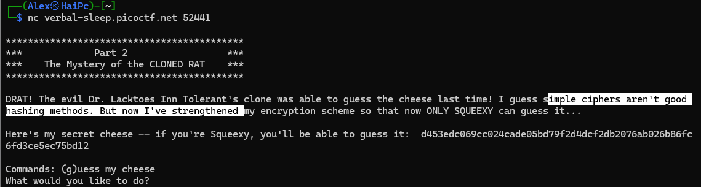

# Guess My Cheese (Part 2)
## Deskripsi Challange
Penipu itu berhasil menipu kita kali ini, jadi kita telah memperkuat pertahanan kita!
Berikut adalah [daftar keju](./cheese_list.txt) kami.

`nc verbal-sleep.picoctf.net 52441`

## Analisis
Kita langsung saja melihat cara kerja programnya

Disini ada sebuah penjelasan bahwa cipher yang diberikan merupakan hasil dari hasing. Tetapi ada penjelasan tambahan bahwa kemudian enkripsi yang ada tersebut juga telah di perkuat. Dibagian terakhir juga kita diberikan sebuah hex sepanjang 64 bit.

Hipotesa awal saya adalah kita diberikan sebuah hash SHA-256(karena panjang hexaya 64 bit) yang mana kemudian hash tersebut di berikan salt agar mempersulit proses crackingnya.

## Hash Salting
[Dikutip dari geekforgeeks](https://www.geeksforgeeks.org/ethical-hacking/what-is-salted-password-hashing/) Salt adalah string acak yang aman secara kriptografis yang ditambahkan ke kata sandi sebelum di-hash, dan salt tersebut harus disimpan bersama dengan hash-nya, sehingga penyerang tidak dapat mengetahui teks asli tanpa memiliki akses ke kedua sumber tersebut.

Untuk langkah-langkah saltingnya sendiri sebagai berikut:
1. Membuat salt dengan men-generate string random
2. Menggaungkan salt dengan teks bisa di tambahkan di depan atau belakang teks.
3. Melakukan hasing

## Penyelesaian
Setelah kita selesai menganalisa dan memahami cara kerja dari salting pada hash kita akan membuat sebuah program penyelesaian. Program nya ini akan melakukan otomasi pada proses nc. Dimana saya menggunakan library yang bertugas melakukan otomasi tersebut.

Juga pada program kita berikan fungsi untuk melakukan cracking pada hash. Cara kerja dari fungsinya adalah dengan membaca file dari [cheese_list.txt](./cheese_list.txt). Lalu melakukan perulangan yang membuat variasi teks dari original kemudian di lowercasekan dan di uppercasekan. Juga melakukan perulangan untuk mencoba semua kombinasi salt dan kombinasi peletakannya. Terakhir ada pengkondisian yang mengecek hasil apakah hasil hash sesuai jika sesuai maka fungsi berhenti. Dan jawaban di kirimkan.

Kode programnya bisa kalian [lihat disini](./hashCrack.py)