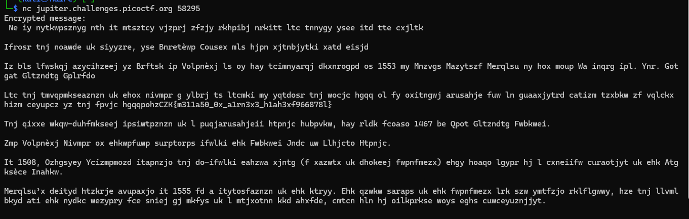

# Deskripsi Challange
Saya menemukan sandi ini di sebuah buku tua. Dapatkah Anda mengetahui apa yang tertulis di dalamnya? Hubungkan dengan `nc jupiter.challenges.picoctf.org 58295`.

## Penyelesaian

Awalnya saya mengira bahwa ini adalah Aristocrat Cipher. Akan tetapi setelah melihat hint yang menyuruh untuk mencari historisnya. Setelah dicari ternyata judul dari challange nya ada hubungan dengan Vigenere Cipher.

Kita bisa melakukan reverse pada cipher text ini `pohzCZK{m311a50_0x_a1rn3x3_h1ah3xf966878l}` dan akan menghasilkan `agflAGF{x311s50_0v_m1pu3s3_s1sf3jd966878s}`. Bisa dilihat keynya adalah agfl. Sebenarnya aslinya flag cuman karena kita potong makanya kita mulai dari ag kemudial fl. dan yap kita mendapatkan flagnya `picoCTF{b311a50_0r_v1gn3r3_c1ph3ra966878a}`.