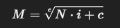
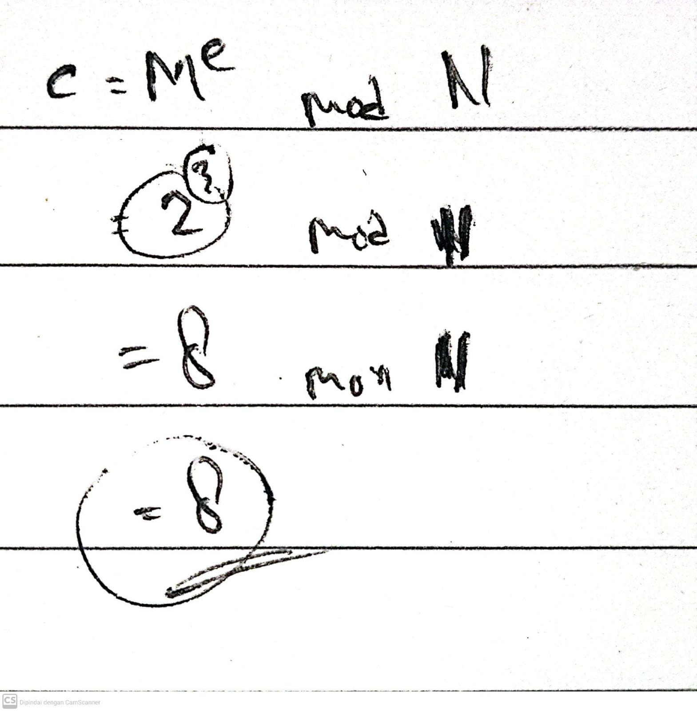
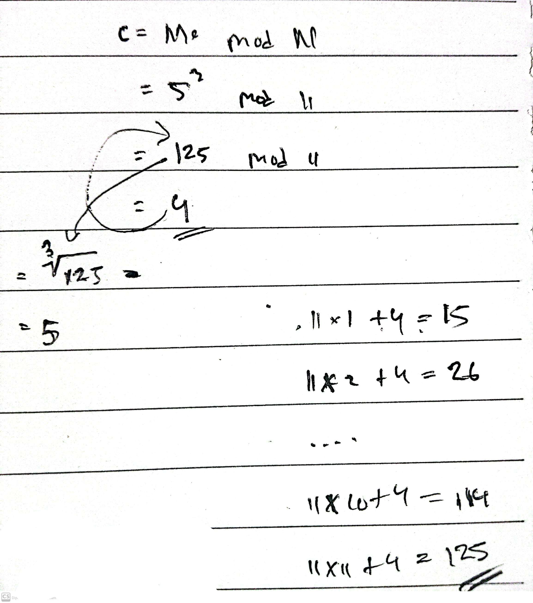

# Mini RSA
## Dekripsi Challange
Apa yang terjadi jika Anda memiliki eksponen yang kecil? Namun ada sedikit perubahan, kita mengisikan plaintext sehingga (M ** e) sedikit lebih besar dari N. Mari kita dekripsi ini: [Cipher](https://mercury.picoctf.net/static/e7e63a387acc347648918f419d1ae438/ciphertext)

## Penyelesaian
Berdasarkan deskripi, kita disini diminta untuk mendekripsi RSA yang memiliki exponen yang kecil yaitu 3. Akan tetapi karena penambahan padding sehingga hasil tersebut bisa di moduluskan.

Nah saya sebenarnya cukup bingung bagaimana cara mencari nilai asli dari M tersebut. Setelah mengeksplor di internet saya menemukan rumus berikut :

_Sumber rumus: [Gumn4m1](https://medium.com/@Gumn4m1/mini-rsa-3af34269c174) 

_

Agar lebih enak membedahnya mari ubah nilai nilainya menjadi nilai kecil agar lebih mudah kita hitung secara manual. Anggap disini kita memiliki nilai M = 2, e = 3 dan N = 11. Dan didapatkanlah nilai 8 sebagai ciphernya. Kita hanya perlu menghitung akar pangkatnya untuk mendapatkan kembali nilai M nya. Nah akan tetapi bagaimana jika ada penambahan padding agap lah 3 sehingga bisa di lakukan operasi modulusnya?

Tentunya jika ada penambahan padding, sehingga bisa dilakukan operasi modulusnya kita tidak bisa menghitung akar pangkatnya saja. Kita juga perlu mengembalikan terlebih dahulu nilai asli exponennya baru setelahnya kita hitung akar pangkatnya barulah mendapatkan nilai Mnya. Perlu dicatat bahwa Rumus ini hanya efektif jika exponennya 3 - 5 karena jika lebih besar maka komputasinya akan sangat berat dan lambat.

Untuk melihat program pythonya bisa kalian [lihat disini](./MiniRSA.py)