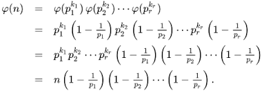

# b00tl3gRSA3
## Deskripsi Challange
Mengapa menggunakan p dan q ketika saya bisa menggunakan lebih banyak? Terhubung dengan `nc jupiter.challenges.picoctf.org 4557`.

## Penyelesaian
Setelah saya mencoba menghubungkan ke net cat tersebut, bisa terlihat bahwa n adalah hasil dari perkalian yang banyak. sehingga kita perlu rumus tertentu untuk mencari b nya. Akan tetapi hal ini bukan yang sulit karna untuk mencari totient rumus yang di perlukan hanya seperti berikut: 


Akan tetapi saya cukup kesulitan dalam memfaktorkan menggunakan python. Karena cukup lambat dan tidak efektif jika kita menggunakan factorint yang hanya cocok untuk n di bawah 200 bit. Setelah melakukan beberapa pencarian saya menemukan website yang gacorrr, dan cocok untuk mencari faktorisasi dari n. Nama websitenya adalah [alpertron](https://www.alpertron.com.ar/ECM.HTM). Dan disini ketika aku memasukkan n ternyata bisa juga memunculkan phi nya . 

Dan yap kita hanya perlu membuat program seperti berikut:
```python
from Crypto.Util.number import long_to_bytes
from sympy.ntheory import factorint

c = 7539792127338969593641402330447298389222866884539853564665315268824721692897845332821525315099892106248356890733461595898157581071054878875704091338344990139108251642742962535534118248735077901227296947144280236070536220208304311128988269432482157501734477100022522809200004058840123834671284913539067569072132192049067799241590152842077459346
n = 10913037102170544152864551337175698388281329276623118236741107494142768809400944809757993967886779794270764896868442594171274444336319495810147657419511721615485385171248926057384044476955637051581038040753858562668839232108372623446828560256852036341180581526390166093390839787160359254692727316353496002586358869125871503003128441852237527143
e = 65537

# I use tool from https://www.alpertron.com.ar/ECM.HTM
tN = int("".join(n for n in '10 913037 071409 968603 568373 201030 817309 220640 149838 127396 201150 733144 102609 501609 677422 264669 716652 991709 797703 307227 931020 448943 658803 227371 559189 140173 230803 508923 833986 570173 314555 679177 227370 903621 094579 978136 487550 525106 057320 124535 586654 625821 436932 294793 621247 290763 713340 704675 861427 531453 118720 370193 965753 523067 654848 380928 000000 000000'.split()))

d = pow(e, -1, tN)
print(long_to_bytes(pow(c, d, n)))
```